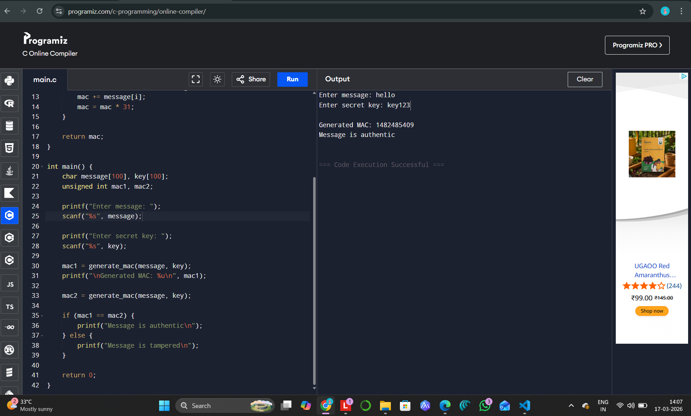

# EX-NO-13-MESSAGE-AUTHENTICATION-CODE-MAC

## AIM:
To implement MESSAGE AUTHENTICATION CODE(MAC)

## ALGORITHM:

1. Message Authentication Code (MAC) is a cryptographic technique used to verify the integrity and authenticity of a message by using a secret key.

2. Initialization:
   - Choose a cryptographic hash function \( H \) (e.g., SHA-256) and a secret key \( K \).
   - The message \( M \) to be authenticated is input along with the secret key \( K \).

3. MAC Generation:
   - Compute the MAC by applying the hash function to the combination of the message \( M \) and the secret key \( K \): 
     \[
     \text{MAC}(M, K) = H(K || M)
     \]
     where \( || \) denotes concatenation of \( K \) and \( M \).

4. Verification:
   - The recipient, who knows the secret key \( K \), computes the MAC using the received message \( M \) and the same hash function.
   - The recipient compares the computed MAC with the received MAC. If they match, the message is authentic and unchanged.

5. Security: The security of the MAC relies on the secret key \( K \) and the strength of the hash function \( H \), ensuring that an attacker cannot forge a valid MAC without knowledge of the key.

## Program:
```
#include <stdio.h>
#include <string.h>

unsigned int generate_mac(char message[], char key[]) {
    unsigned int mac = 0;

    for (int i = 0; i < strlen(key); i++) {
        mac += key[i];
        mac = mac * 31;
    }

    for (int i = 0; i < strlen(message); i++) {
        mac += message[i];
        mac = mac * 31;
    }

    return mac;
}

int main() {
    char message[100], key[100];
    unsigned int mac1, mac2;

    printf("Enter message: ");
    scanf("%s", message);

    printf("Enter secret key: ");
    scanf("%s", key);

    mac1 = generate_mac(message, key);
    printf("\nGenerated MAC: %u\n", mac1);

    mac2 = generate_mac(message, key);

    if (mac1 == mac2) {
        printf("Message is authentic\n");
    } else {
        printf("Message is tampered\n");
    }

    return 0;
}
```


## Output:


## Result:
The program is executed successfully.
